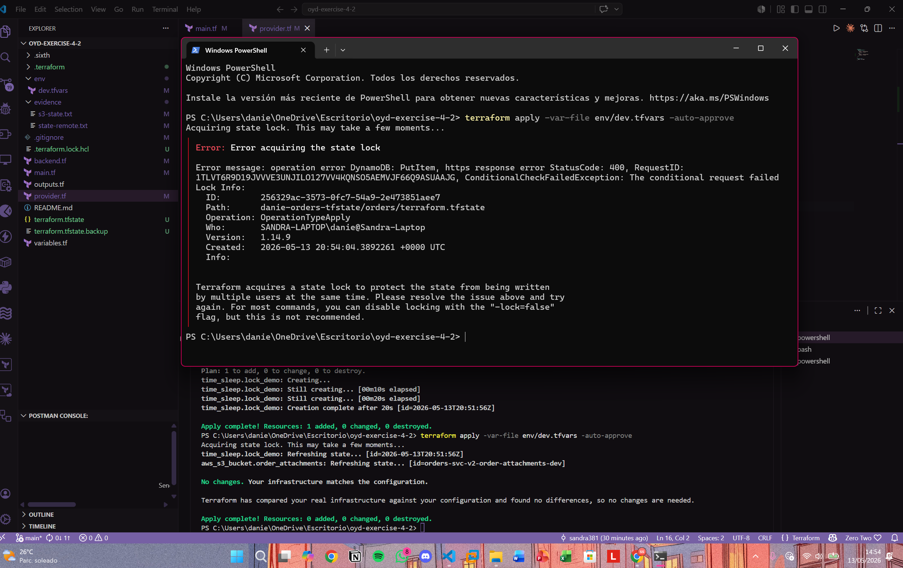

# oyd-exercise-4-2

Migración de estado remoto para el servicio de órdenes usando Terraform con backend S3 y bloqueo con DynamoDB.

## Descripción

Este proyecto demuestra cómo migrar un workspace de Terraform de estado local a estado remoto en S3, con bloqueo de concurrencia usando DynamoDB.

- **Backend S3**: `danie-orders-tfstate` — almacena el archivo de estado remoto
- **Tabla DynamoDB**: `danie-orders-locks` — previene applies concurrentes mediante bloqueo
- **Recurso principal**: bucket S3 `orders-svc-v2-order-attachments-dev`

## Estructura del proyecto

```
oyd-exercise-4-2/
├── provider.tf
├── main.tf
├── variables.tf
├── env
    ├── dev.tfvars
├── backend.tf
├── .gitignore
└── evidence/
    ├── state-remote.txt
    ├── s3-state.txt
    └── lock-contention.png
```

## Requisitos previos

- Terraform >= 1.8
- AWS CLI configurado con credenciales válidas

## Backend

El estado remoto está configurado en `backend.tf`:

```hcl
terraform {
  backend "s3" {
    bucket         = "danie-orders-tfstate"
    key            = "orders/terraform.tfstate"
    region         = "us-east-1"
    dynamodb_table = "danie-orders-locks"
    encrypt        = true
  }
}
```

## Uso

```bash
terraform init
terraform apply -var-file=terraform.tfvars
```

## Evidence

### terraform state list

```
aws_s3_bucket.order_attachments
```
[Evidencia del state remote](evidence/state-remote.txt)

### aws s3 ls s3://danie-orders-tfstate/orders/

```
2026-05-13 14:35:37       2934 terraform.tfstate
```
[Evidencia del s3 state](evidence/s3-state.txt)

### Lock Contention

La siguiente captura muestra el error de bloqueo cuando dos applies se ejecutan al mismo tiempo. El segundo apply no puede adquirir el lock porque DynamoDB ya registró al primer proceso como titular del lock.

